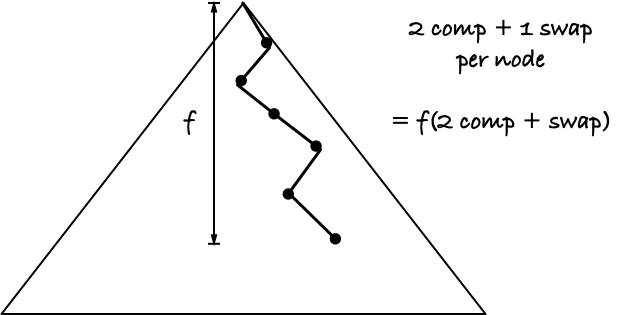
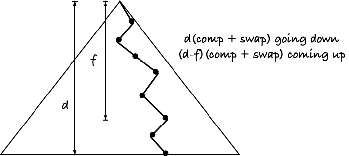

## Work out which approach might be better than the other:

First approach:

Second approach: 

I want to find the spot where they are equally good

> First approach = second approach

> f(2 comp + swap) = d(comp + swap) + (d-f)(comp + swap) 

*d* is the depth of the entire heap, and we set it to 1

> f(2 comp + swap) = comp + swap - f(comp + swap)

The proporty of *f* where first and second approach is equal is: 

> f = (comp + swap) / (3 comp + 2 swap)

If the cost of doing a swap and a comparison is the same, the depth, *f*, of the node, where first and second approach is equally expensive is

> f = (1 + 1) / (3 * 1 + 2* 1) = 2/5

If they are equally expensive, for a node depper than 2/5 of the three the second approach will be better (40 % of the depth)

If swapping is more expensive than comparisons (which they probably are) the node is closer to the bottom when they are equally expensive (because the second approach uses more swaps, and the number increases as the node gets closer to the root)

If comparisons are more expensive than swaps the node is closer to the root (compared to 2/5 deep) before they are equally expensive (because the first approach uses twice as many comparisons going down)
